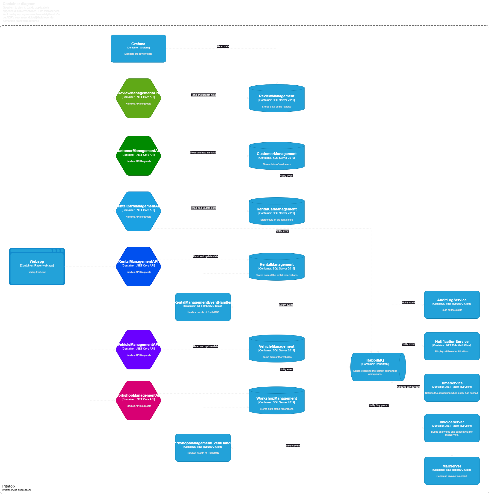

# Technisch ontwerp
## Inleiding
Dit technisch ontwerp is geschreven aan de hand van het C4-model. Dit model is tussen
2006 en 2011 bedacht door Simon Brown. Dit model documenteert de architectuur van
softwaresystemen door meerdere overzichtsniveaus te tonen die de decompositie van een
systeem in containers en componenten, de relatie tussen deze elementen en, waar van
toepassing, de relatie met zijn gebruikers verklaren. Hieronder staan de overzichtsniveaus
met een korte uitleg:

● Level 1: Context:  
Dit niveau toont het geheel van het systeem en de relatie met
gebruikers en andere systemen.

● Level 2: Container:  
Ontbindt het systeem in onderling gerelateerde containers. Een
container stelt een applicatie of database voor.

● Level 3: Component:  
Dit niveau ontbindt de verschillende containers in meerdere
componenten en laat de relatie tussen de componenten zien.

● Level 4: Code:  
Dit niveau geeft de bouwstenen weer waarmee de componenten zijn
opgebouwd. Hij bevat bijvoorbeeld class diagrams, sequence diagrams en activity
diagrams.

Om de lezer het eenvoudig te maken is er een legenda opgesteld waarin beschreven wordt
welke onderdelen terug gaan komen in dit document en welke kleur daaraan gekoppeld
staat:

## Level 1: Context

Hierboven staat de context diagram van de Pitstop applicatie. Goed te zien is dat het systeem twee verschillende gebruikers kent.
De klant en de monteur. De klant kan een afspraak maken en de monteur kan deze afspraak accepteren of weigeren. 
De klant kan ook een review achterlaten over de monteur. Waarna de monteur aangeeft klaar te zijn met de reparatie. Zal
er automatisch een factuur worden verstuurd via de mail richting de gebruiker. Tijdens de reperatie kan een medewerker of een klant
een leenauto reserveren. 

## Level 2: Container

Hierboven staat het container diagram van de Pitstop applicatie. Goed te zien is dat pitstop geen monolith is. Hij is
opgedeeld in meerdere microservices elke microservice heeft zijn eigen verantwoordelijkheid. Mocht een microservice afhankelijk
zijn van een andere microservice dan wordt er gebruik gemaakt van RabbitMQ. Een goed voorbeeld hoe dit werkt is wanneer er een Customer wordt
toegevoegd. De CustomerManagementAPI voegt de customer toe en na toevoegen zal hij een event sturen naar RabbiMQ. Dit event
wordt vervolgens doorgestuurd naar de WorkshopManagementAPI en de RentalManagementAPI. Deze twee microservices zal hierop reageren
door de net aangemaakte customer toe te voegen aan hun eigen database. Dit volgt het principe van Autonomy over Authority.
Hierbij houdt elke microservice zijn eigen context bij en slaan meerdere microservices misschien wel dezelfde data op. Zoals te zien
op het volgende plaatje over een bounded context.

Deze aanpak voorkomt dat microservices veel met elkaar moeten communiceren. Daarnaast zorgt dit voor een stabielere applicatie.
Mocht er een microservice uitvallen dan zal de rest van de applicatie nog steeds werken. En omdat ze een eigen versie bijhouden
van hun bounded context hoeven ze die in dat geval niet op te halen bij een andere microservice. En kunnen zij daarom gewoon
doorgaan met hun werkzaamheden.

## Level 3: Components

## Level 4: Code